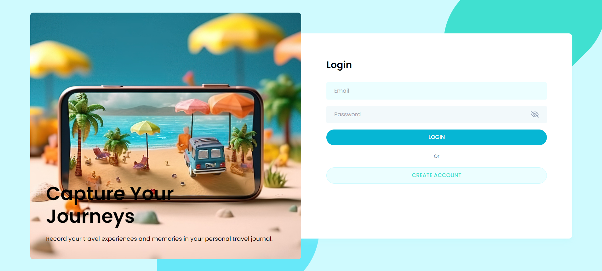
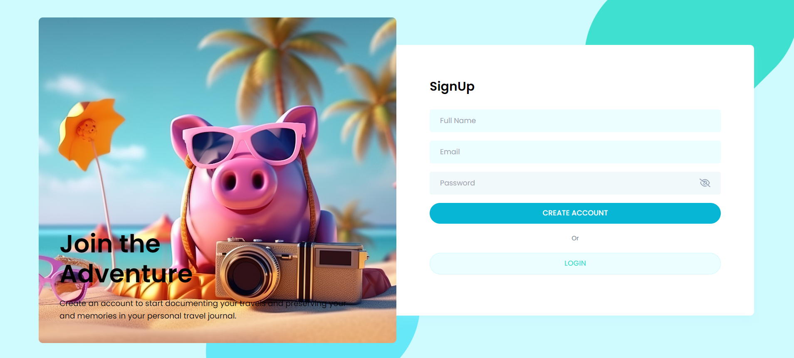

## Reflecting on My Learning Journey in Full-Stack Development

### The MERN Stack:

The MERN stack has served as the foundation for my full-stack development experience. Each component of the stack contributes to a comprehensive understanding of web development, enabling me to build robust applications.

#### MongoDB:

My journey began with MongoDB, a NoSQL database that allows for flexible data storage. I learned how to design schemas and create collections, which are fundamental for organizing data. Through hands-on experience, I discovered the importance of structuring data effectively, especially when dealing with relationships between different entities.

**Key Takeaway**: The flexibility of MongoDB allows for rapid prototyping and iterative development, which is particularly beneficial in the early stages of project development. However, I also realized that careful planning is necessary to ensure data integrity and efficient querying as the application scales.

#### Express.js:

Express.js has been crucial in my understanding of server-side development. It provides a streamlined framework for building web applications and APIs, allowing for efficient routing and middleware management. I learned how to create RESTful APIs, handling various HTTP requests, and implementing middleware for tasks such as authentication and logging.

**Key Takeaway**: The use of middleware in Express.js taught me the importance of separating concerns in my application. By modularizing functionality, I was able to maintain cleaner code and enhance the overall structure of my projects.

#### React:

Transitioning to the frontend, React has become a vital part of my development toolkit. Its component-based architecture facilitates the creation of reusable UI components, which I found essential for maintaining a consistent user experience. The introduction of hooks, particularly `useState` and `useEffect`, allowed me to manage component state and side effects more effectively.

**Key Takeaway**: Understanding the lifecycle of components in React has significantly improved my ability to handle asynchronous data fetching and rendering. The `useEffect` hook, in particular, enabled me to synchronize my components with external data sources seamlessly.

#### Node.js:

Node.js has provided me with the environment to run JavaScript on the server. This has allowed me to use a single language for both client and server-side development, which simplifies the learning curve. I learned how to set up a server, handle routing, and integrate with MongoDB for data persistence.

**Key Takeaway**: The event-driven architecture of Node.js has enhanced my understanding of handling concurrent requests. This knowledge has been crucial in optimizing performance, particularly in applications that require real-time updates.

#### State Management with React Hooks

One of the most significant challenges was managing component state effectively. In React, the `useState` hook provides a way to declare state variables, while `useEffect` allows for side effects such as data fetching. I initially struggled with understanding how to structure my components and manage their state. However, through practice and experimentation, I became proficient in handling asynchronous data, which was crucial for retrieving user information and notes through API calls.

**Key Learning**: The importance of understanding the relationship between state and UI rendering became clear to me. I learned that inefficient state management can lead to performance issues and a poor user experience. Therefore, mastering the use of hooks has been a key focus in my learning journey.

#### API Integration with Axios

Integrating RESTful APIs using Axios was another critical aspect of my learning process. Axios allowed me to handle HTTP requests seamlessly, and I learned how to manage authentication headers to secure my API endpoints. I gained valuable experience in configuring Axios instances and managing errors related to authorization.

**Key Learning**: Effective error handling is essential in any application that relies on external data sources. I learned to implement strategies for gracefully handling failures, which significantly improved the user experience by providing clear feedback.

#### Form Handling and Validation

Creating a user-friendly UI for adding and editing notes challenged my form management skills. I implemented validation logic to ensure data integrity, which required a deeper understanding of both frontend and backend interactions. The validation process taught me how to provide immediate feedback to users, enhancing the overall usability of my application.

**Key Learning**: The importance of user experience in form design became evident. Ensuring that forms are intuitive and provide clear validation messages is crucial for maintaining user engagement and preventing frustration.

#### Error Handling and Debugging

A significant challenge arose when I encountered a bug that caused duplicate requests in my application. This experience refined my understanding of the `useEffect` dependencies and the importance of cleanup functions. I learned to carefully analyze the flow of data and component lifecycle to identify the root cause of issues.

**Key Learning**: Debugging is an essential skill that every developer must master. I realized that a methodical approach to identifying and resolving bugs can lead to improved app performance and efficient network usage.

### UI Modals and Reusability

Implementing reusable modals for adding and editing notes taught me the value of keeping code modular and clean. By creating generic modal components, I was able to enhance the maintainability of my codebase and reduce redundancy.

**Key Learning**: The concept of reusability is crucial in software development. Building components that can be reused across different parts of the application not only saves time but also promotes consistency in design and functionality.

### Key Takeaways

1. **Component Structure and Organization**: A clear component structure is vital for maintainability. Organizing components based on their functionality and ensuring proper separation of concerns will streamline the development process.

2. **Patient Debugging**: Debugging can be a frustrating experience, but maintaining patience and a systematic approach can lead to successful resolutions. The ability to troubleshoot effectively is a valuable skill that will serve me well in future projects.

3. **Continuous Learning**: The field of web development is constantly evolving. Staying updated with the latest technologies and best practices is crucial for remaining competitive. I plan to continue learning through online courses, tutorials, and community involvement.

4. **Collaboration and Code Reviews**: Engaging with fellow developers and participating in code reviews has provided valuable feedback and insights. Collaboration fosters learning and encourages the sharing of knowledge, which ultimately leads to better coding practices.

5. **Focus on User Experience**: Prioritizing user experience in every aspect of development is essential. Ensuring that applications are intuitive and enjoyable to use will contribute to higher user satisfaction and engagement.

### Areas for Improvement

1. **Advanced State Management**: While I have a solid grasp of basic state management with hooks, exploring more advanced state management solutions like Redux or Context API will be beneficial for managing complex state interactions.

2. **Testing Practices**: I recognize the importance of testing in software development. Familiarizing myself with testing frameworks such as Jest or React Testing Library will enhance the reliability of my applications and instill confidence in my code.

3. **Performance Optimization Techniques**: Learning about performance optimization strategies, such as memoization and code-splitting, will be crucial for building efficient applications that can scale effectively.

4. **Understanding Back-End Concepts**: Delving deeper into back-end development concepts, such as database design and RESTful API best practices, will strengthen my ability to create robust applications.

5. **Deployment and DevOps Practices**: Gaining experience with deployment processes and CI/CD practices will provide valuable skills for delivering applications to users efficiently. Understanding how to set up pipelines and automate deployments will enhance my development workflow.

6. **UI/UX Design Principles**: Improving my understanding of UI/UX design principles will enable me to create more intuitive and visually appealing applications. Exploring design tools and concepts will contribute to my overall development as a full-stack developer.
