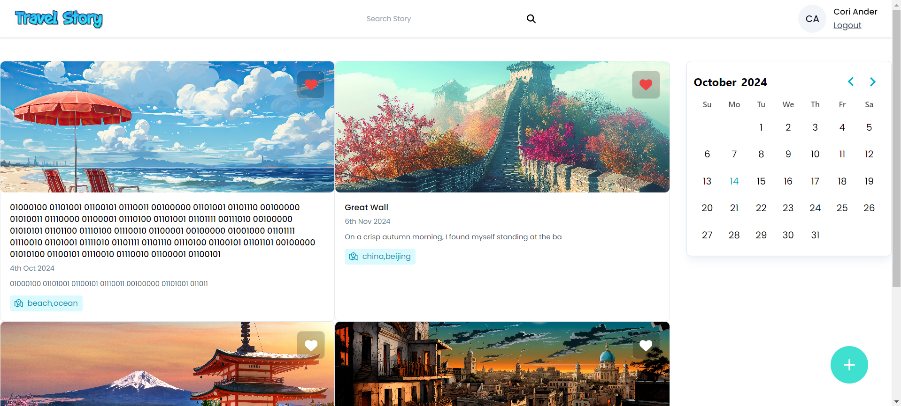

## Reflecting on My Learning Journey in Full-Stack Development
#### MongoDB:
**Learning**: The flexibility of MongoDB allows for rapid prototyping and iterative development, which is particularly beneficial in the early stages of project development. However, I also realized that careful planning is necessary to ensure data integrity and efficient querying as the application scales.

#### Express.js:
**Learning**: The use of middleware in Express.js taught me the importance of separating concerns in my application. By modularizing functionality, I was able to maintain cleaner code and enhance the overall structure of my projects.

#### React:
**Learning**: Understanding the lifecycle of components in React has significantly improved my ability to handle asynchronous data fetching and rendering. The `useEffect` hook, in particular, enabled me to synchronize my components with external data sources seamlessly.

#### Node.js:
**Learning**: The event-driven architecture of Node.js has enhanced my understanding of handling concurrent requests. This knowledge has been crucial in optimizing performance, particularly in applications that require real-time updates.

#### State Management with React Hooks

One of the most significant challenges was managing component state effectively. In React, the `useState` hook provides a way to declare state variables, while `useEffect` allows for side effects such as data fetching. I initially struggled with understanding how to structure my components and manage their state. However, through practice and experimentation, I became proficient in handling asynchronous data, which was crucial for retrieving user information and notes through API calls.

**Learning**: The importance of understanding the relationship between state and UI rendering became clear to me. I learned that inefficient state management can lead to performance issues and a poor user experience. Therefore, mastering the use of hooks has been a key focus in my learning journey.

#### API Integration with Axios

Integrating RESTful APIs using Axios was another critical aspect of my learning process. Axios allowed me to handle HTTP requests seamlessly, and I learned how to manage authentication headers to secure my API endpoints. I gained valuable experience in configuring Axios instances and managing errors related to authorization.

**Learning**: Effective error handling is essential in any application that relies on external data sources. I learned to implement strategies for handling failures, which significantly improved the user experience by providing clear return messages.

#### Form Handling and Validation

Creating a user-friendly UI for adding and editing notes challenged my form management skills. I implemented validation logic to ensure data integrity, which required a deeper understanding of both frontend and backend interactions. The validation process taught me how to provide immediate feedback to users, enhancing the overall usability of my application.

**Learning**: The importance of user experience in form design became evident. Ensuring that forms are intuitive and provide clear validation messages is crucial for maintaining user engagement and preventing frustration.

#### Error Handling and Debugging

A significant challenge arose when I encountered a bug that caused duplicate requests in my application. This experience refined my understanding of the `useEffect` dependencies and the importance of cleanup functions. I learned to carefully analyze the flow of data and component lifecycle to identify the root cause of issues.

**Learning**: Debugging is an essential. I realized that a methodical approach to identifying and resolving bugs can lead to improved app performance and efficient network usage.

### UI Modals and Reusability

Implementing reusable modals for adding and editing notes taught me the value of keeping code modular and clean. By creating generic modal components, I was able to enhance the maintainability of my codebase and reduce redundancy.

**Learning**: The concept of reusability is crucial in software development. Building components that can be reused across different parts of the application not only saves time but also promotes consistency in design and functionality.
